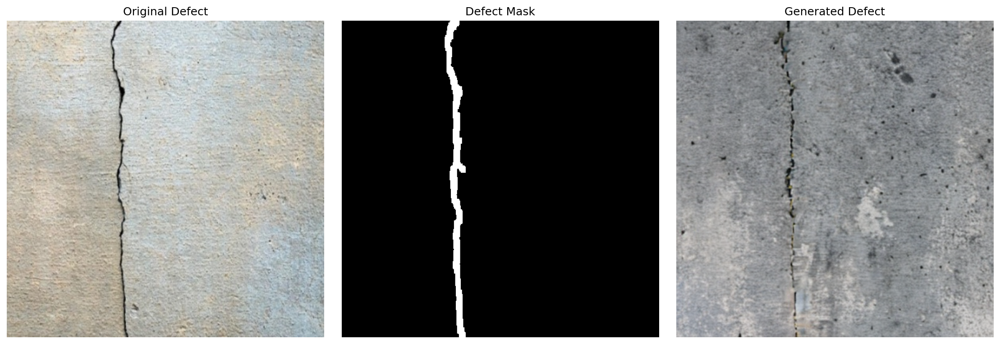
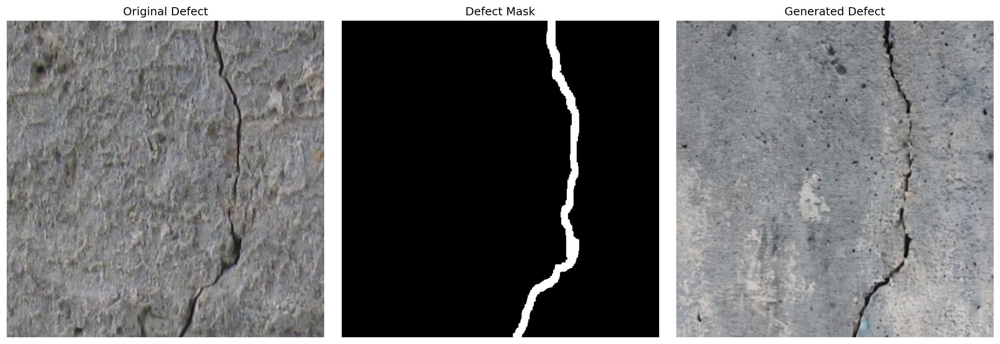
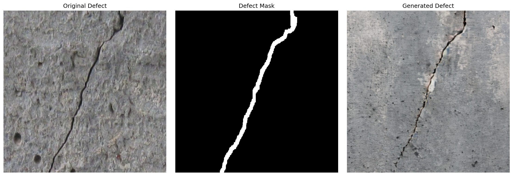
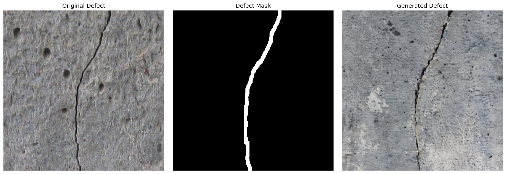
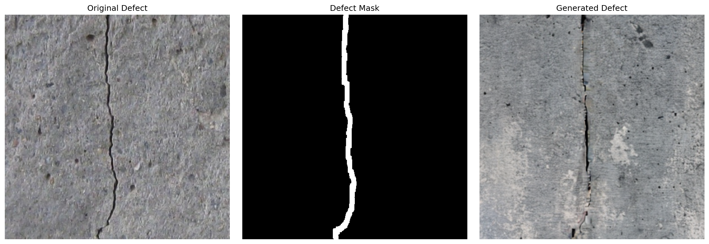
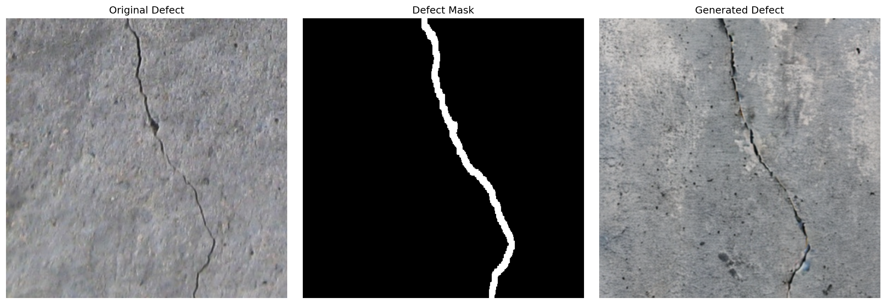

# DefectFill: Realistic Defect Generation for Visual Inspection

**DefectFill** is an implementation of an inpainting-based diffusion model designed to generate realistic surface defects for data augmentation in industrial visual inspection.

Currently, this repository is tuned to generate **cracks in concrete** (using the MVTec AD dataset) as a proof-of-concept. The ultimate goal of this project is to apply these techniques to generate synthetic training data for **cast iron defects** (e.g., blowholes, cracks) in foundry settings.

## Visual Results

Below are generated examples showing the model's ability to fill healthy regions with realistic defect textures while preserving the surrounding structural integrity.

|||
| :---: | :---: |
|  |  | 
|  |  | 
|  |  |

## Methodology

This implementation leverages **Stable Diffusion 2 Inpainting** with **LoRA (Low-Rank Adaptation)** fine-tuning. To ensure high-quality generation that blends seamlessly with the object, the training process utilizes a dual-branch strategy:

1.  **Defect Branch**: Learns the specific texture and features of the defect (e.g., "crack") using a learnable `<defect>` token.
2.  **Object Branch**: Enforces structural integrity of the non-defective background to prevent the model from hallucinating unwanted changes in the healthy regions.

During inference, we utilize **LPIPS (Learned Perceptual Image Patch Similarity)** to automatically select the most realistic samples from a batch of generations.

## Installation

1.  Clone the repository:
    ```bash
    git clone [https://github.com/axelsig1/defectfill.git](https://github.com/axelsig1/defectfill.git)
    cd defectfill
    ```

2.  Install the required dependencies:
    ```bash
    pip install -r requirements.txt
    ```

**Requirements include:** `torch`, `diffusers`, `transformers`, `peft`, `lpips`, and `albumentations`.

## Data Preparation

This project follows the **MVTec AD** dataset structure. Ensure your data is organized as follows:
```
data/
└── concrete/              # Object Class
    ├── train/
    │   ├── defective/
    │   │   └── crack/     # Defect images
    │   └── defective_masks/
    │       └── crack/     # Corresponding binary masks
    └── test/
        └── good/          # Healthy reference images
```
## Usage

### 1. Training

To train the model on concrete cracks:

```bash
python train.py \
  --data_dir ./data \
  --object_class concrete \
  --defect_type crack \
  --output_dir ./output_concrete \
  --lora_rank 8 \
  --lora_alpha 16 \
  --max_train_steps 2000
```

Key Arguments:

--lambda_defect: Weight for the defect texture loss.

--lambda_obj: Weight for the background integrity loss.

--alpha: Background blending weight for the object branch.

### 2. Inference
Generate new synthetic defects on healthy images. The script uses LPIPS to pick the best generation from a batch of candidates.
```bash
python inference.py \
  --checkpoint ./output_concrete/checkpoints/checkpoint_final.pt \
  --object_class concrete \
  --defect_type crack \
  --data_dir ./data \
  --output_dir ./generated_cracks \
  --total_images 6 \
  --num_samples 8 \
  --guidance_scale 2.0
```

## Future Work
Cast Iron Adaptation: Transitioning the domain from concrete textures to metal surfaces to detect manufacturing defects in foundries.

Defect Variety: Expanding support for blowholes, shrinkage, and sand inclusions.

## References
This code is an implementation based on the concepts of "DefectFill" for industrial anomaly generation. 	arXiv:2503.13985
