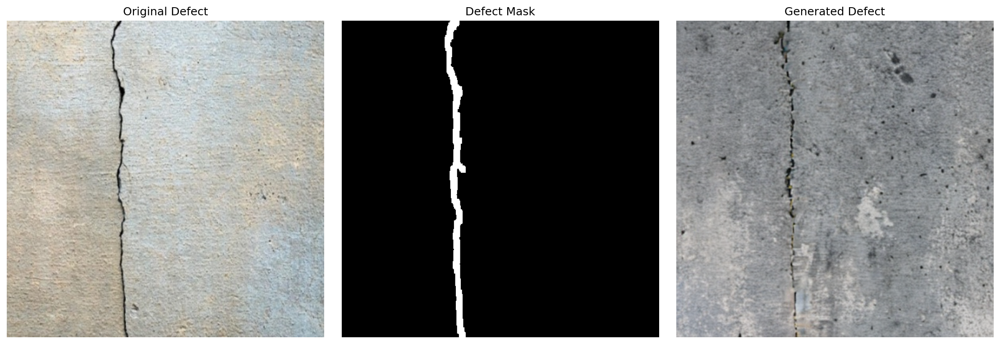
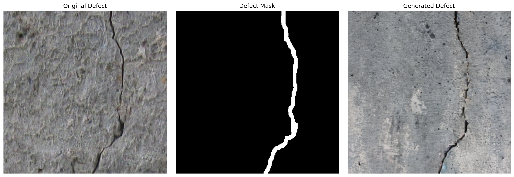
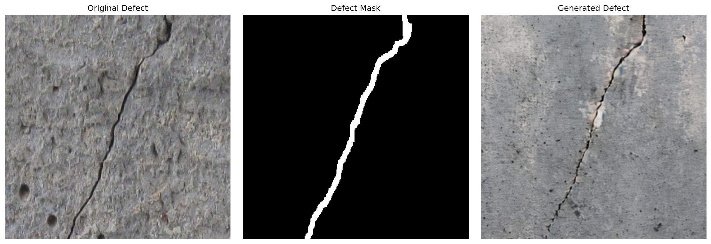
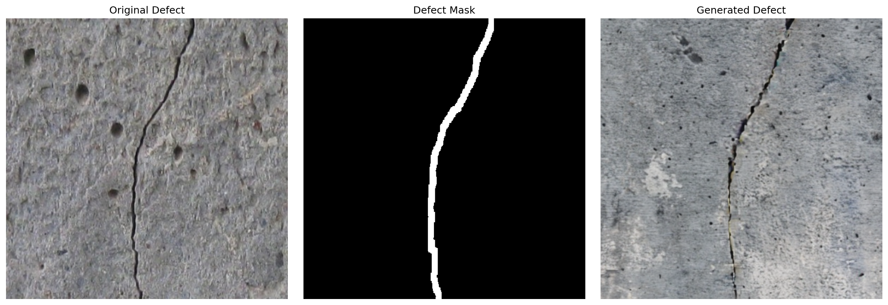
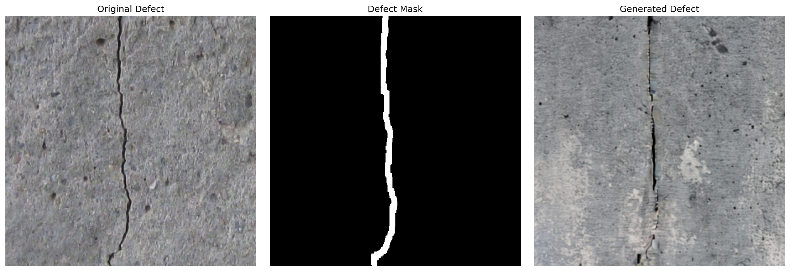
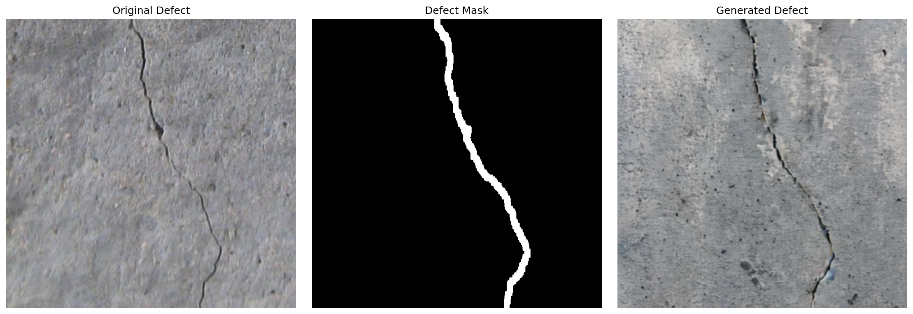

# DefectFill: Realistic Defect Generation for Visual Inspection

Realistic defect image generation via fine-tuned inpainting diffusion models.

> Implementation of **DefectFill: Realistic Defect Generation with Inpainting Diffusion Model for Visual Inspection** (CVPR 2024).

---

Currently, this repository is tuned to generate **cracks in concrete** (using the MVTec AD dataset) as a proof-of-concept. The ultimate goal of this project is to apply these techniques to generate synthetic training data for **cast iron defects** (e.g., blowholes, cracks) in foundry settings.

## Visual Results

Below are generated examples showing the model's ability to fill healthy regions with realistic defect textures while preserving the surrounding structural integrity.

|||
| :---: | :---: |
|  |  | 
|  |  | 
|  |  |

---

## Overview

DefectFill fine-tunes a Stable Diffusion 2 inpainting model with LoRA to learn a specific defect concept from a small set of reference images. Three complementary loss terms drive training:

| Loss | Weight | Purpose |
|------|--------|---------|
| **Defect loss** `L_def` | 0.5 | Precisely captures intrinsic defect features |
| **Object loss** `L_obj` | 0.2 | Learns the semantic relationship between defect and object |
| **Attention loss** `L_attn` | 0.05 | Ensures [V*] token attends to the defect region |

After training, **Low-Fidelity Selection (LFS)** generates 8 candidates per (image, mask) pair and selects the one with the highest LPIPS score inside the masked region — the most "realistic" defect.

---

## Installation

1.  Clone the repository:
    ```bash
    git clone [https://github.com/axelsig1/defectfill.git](https://github.com/axelsig1/defectfill.git)
    cd defectfill
    ```

2.  Install the required dependencies:
    ```bash
    pip install -r requirements.txt
    ```

**Requirements include:** `torch`, `diffusers`, `transformers`, `peft`, `lpips`, and `albumentations`.

---

## Data Preparation

This project follows the **MVTec AD** dataset structure. Ensure your data is organized as follows:
```
data/
└── concrete/              # Object Class
    ├── train/
    │   ├── defective/
    │   │   └── crack/     # Defect images
    │   └── defective_masks/
    │       └── crack/     # Corresponding binary masks
    └── test/
        └── good/          # Healthy reference images
```
## Usage

### 1. Training

To train the model on concrete cracks:

```bash
python train.py \
  --data_dir ./data \
  --object_class concrete \
  --defect_type crack \
  --output_dir ./output_concrete \
  --lora_rank 8 \
  --lora_alpha 16 \
  --max_train_steps 2000
```

Key training details (from paper):
- **Base model**: `sd2-community/stable-diffusion-2-inpainting`
- **LoRA** on UNet attention layers + text encoder projection matrices
- **Warmup**: linear 0 → LR over first 100 steps
- **Augmentation**: random resize ×[1.0, 1.125] + random crop
- **Random masks** M_rand: 30 boxes, sides 3–25% of image size
- **[V*] token**: the word `sks`

### 2. Inference
Generate new synthetic defects on healthy images. The script uses LPIPS to pick the best generation from a batch of candidates.
```bash
python inference.py \
  --checkpoint ./output_concrete/checkpoints/checkpoint_final.pt \
  --object_class concrete \
  --defect_type crack \
  --data_dir ./data \
  --output_dir ./generated_cracks \
  --total_images 6 \
  --num_samples 8 \
  --guidance_scale 2.0
```

---

## Method Details

### Defect Loss (Eq. 5)

```
L_def = E[ || M ⊙ (ε − ε_θ(x_t^def, t, c^def)) ||² ]
```

Background image: `B_def = (1 − M) ⊙ I`  
Input: `x_t^def = concat(x_t, b_def, M)`  
Prompt `P_def = "A photo of sks"`

### Object Loss (Eq. 7)

```
L_obj = E[ || M' ⊙ (ε − ε_θ(x_t^obj, t, c^obj)) ||² ]
M' = M + α·(1 − M),   α = 0.3
```

Random box mask M_rand (30 boxes), `B_rand = (1 − M_rand) ⊙ I`  
Input: `x_t^obj = concat(x_t, b_rand, M_rand)`  
Prompt `P_obj = "A <object> with sks"`

### Attention Loss (Eq. 8)

```
L_attn = E[ || A_t^[V*] − M ||² ]
```

Cross-attention maps from UNet **decoder** (up_blocks) only, averaged over layers and resized to latent resolution.

### Combined Loss (Eq. 9)

```
L_ours = 0.5·L_def + 0.2·L_obj + 0.05·L_attn
```

---

## Citation

```bibtex
@inproceedings{song2024defectfill,
  title={DefectFill: Realistic Defect Generation with Inpainting Diffusion Model for Visual Inspection},
  author={Song, Jaewoo and Park, Daemin and Baek, Kanghyun and Lee, Sangyub and Choi, Jooyoung and Kim, Eunji and Yoon, Sungroh},
  booktitle={Proceedings of the IEEE/CVF Conference on Computer Vision and Pattern Recognition},
  year={2024}
}
```

